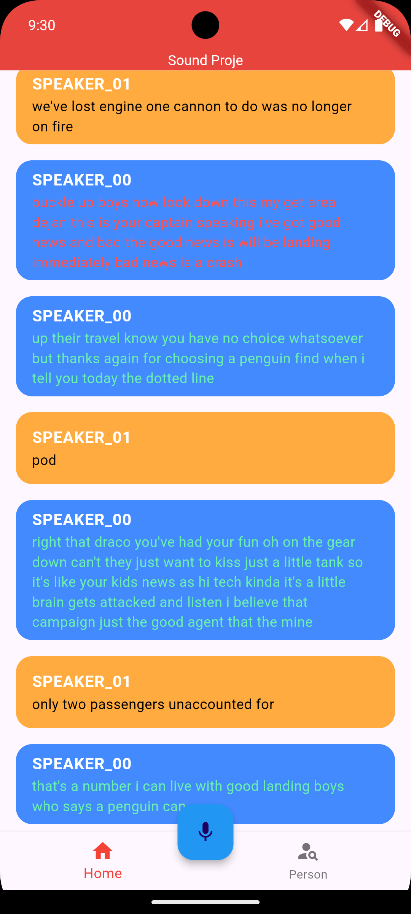
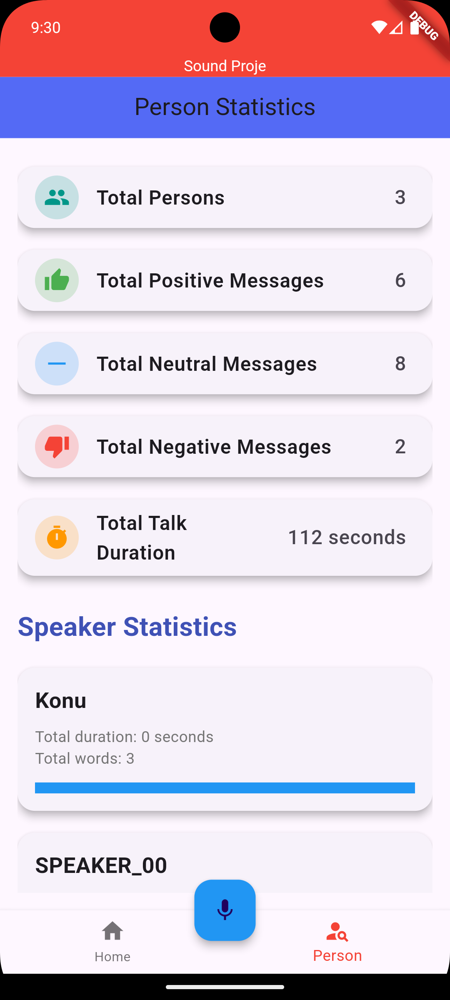

# Sound Class Project

Bu proje, kullanıcı seslerinden bireylerin analizini yaparak kimlik belirleme, ne söylediklerini metin formatında sunma ve söylenenlerin olumlu ya da olumsuz olduklarına dair duygu analizi yapmayı amaçlamaktadır. Proje, Flutter tabanlı bir mobil uygulama ve Django tabanlı bir backend sunucusundan oluşmaktadır.

## Proje Yapısı

```
├── app/
|   ├── lib/
|   └── ...
├── build/
├── django_api/
│   ├── audio/
│   │   ├── views.py
│   │   ├── models.py
│   │   ├── serializers.py
│   └── ...
├── documents/
│   ├── Contract.md
│   ├── Test_Case.md
|   └── ...
└── ...
```
## Ekran Görüntüleri

### Ana Ekran


### Analiz Sonuçları Ekranı

## Kurulum

### Backend ([Django](django_api))

1. Gerekli bağımlılıkları yükleyin:
    ```sh
    pip install -r documents/requirements.txt
    ```
    Not: Bu projede cudf kütüphanesini kullandım. Eğer pc'niz de kullanılamıyorsa pandas'ı kullanabilirsiniz Ama ek düzeltmeler gerekir.

2. Veritabanı migrasyonlarını çalıştırın:
    ```sh
    python django_api/manage.py migrate
    ```

3. Sunucuyu başlatın:
    ```sh
    python django_api/manage.py runserver
    ```

### Frontend ([Flutter](app/lib))

1. Gerekli bağımlılıkları yükleyin:
    ```sh
    flutter pub get
    ```

2. Uygulamayı çalıştırın:
    ```sh
    flutter run
    ```
    Not: flutter içinde kullanmak için serverin IP'sini kullanın.

## Kullanım

### Ses Dosyası Yükleme ve Analiz

1. Mobil uygulamayı açın ve bir ses kaydı buttonuna tıklayın.
2. Ses kaydını bitirmek için kaydı bitir buttununa tıklayın. otomatik olarak ses kaydı dijango sunucusuna gönderirir.
3. Backend, ses dosyasını işleyerek konuşmacı ayrımı ve duygu analizi yapar.
4. Analiz sonuçları mobil uygulamada görüntülenir.

### API

#### Ses Dosyası Yükleme

- Endpoint: `/api/audio/upload/`
- Metot: `POST`
- Parametreler: 

file

 (Ses dosyası)

#### Kişi Bilgileri

- Endpoint: `/api/persons/`
- Metot: `GET`

## Testler

Test senaryoları 

Test_Case.md

 dosyasında belirtilmiştir.

## İletişim

Herhangi bir sorunuz veya geri bildiriminiz için lütfen bizimle iletişime geçin.
